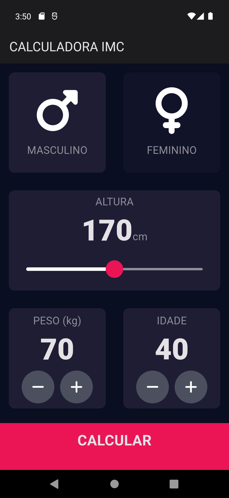
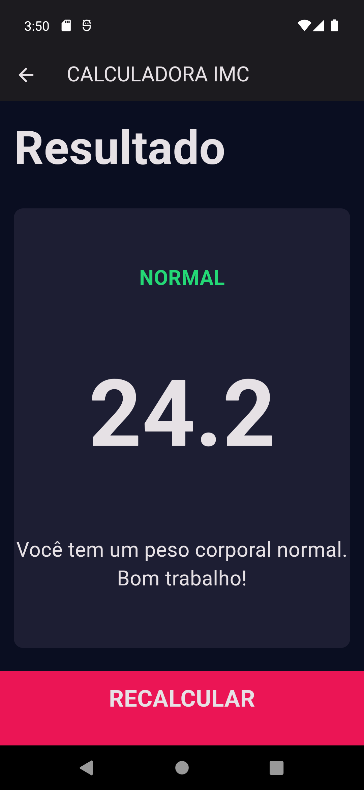

# Calculadora de IMC (Índice de Massa Corporal)

Com base em suas informações corporais, este aplicativo irá apresentar o resultado de seu IMC. 

Inspirado no designer de [Ruben Vaalt](https://dribbble.com/shots/4585382-Simple-BMI-Calculator).

[Demo](https://heliomarpm.github.io/flutter-calc_imc/)

## Funcionalidades

- Insira seu peso (em quiloramas) e altura (em centimetros).
- O aplicativo calculará automaticamente o IMC.
- Fornece uma interpretação do IMC com base nos seguintes intervalos:
  - **Abaixo do peso**: IMC < 18.5
  - **Peso normal**: 18.5 ≤ IMC < 24.9
  - **Sobrepeso**: 25 ≤ IMC < 29.9
  - **Obesidade**: IMC ≥ 30

## Capturas de Tela

 

## Contribuições

Contribuições são bem-vindas! Sinta-se à vontade para abrir um **pull request** com melhorias ou correções.

## Licença

Este projeto está licenciado sob a Licença MIT.

---

Aproveite o desenvolvimento e divirta-se calculando o IMC! 📏💪
